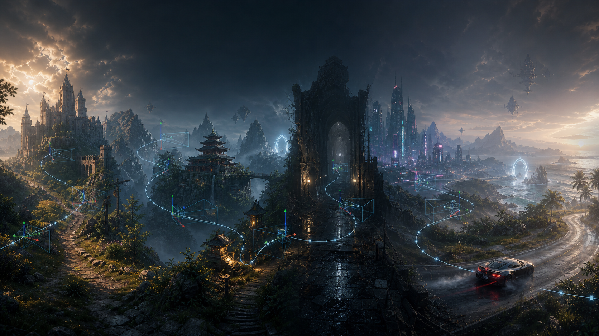

<p align="center">
  
</p>

<h1 align="center">Game Camera Capture Lab</h1>

<p align="center">
  <strong>Turn offline games into controllable, reproducible visual-data environments.</strong>
</p>

<p align="center">
  <a href="README.md">中文</a> · <a href="README.en.md">English</a>
</p>

<p align="center">
  <a href="LICENSE"></a>
  
  
  
  
</p>

This is a complete multi-game camera-data capture project—not merely a free camera and not merely a screenshot script. It connects **camera control, pose feedback, spatial point maps, 22-view still scans, continuous trajectories, OBS capture, resumable progress, and dataset manifests** into one reproducible pipeline.

The project began with RE9 and now discovers independent adapters through `games/*/game.json`. Its new, self-developed **UE Camera Runtime** can inject a free camera into supported offline Unreal games, read real poses, issue absolute `setPose`, hide the HUD, and play smooth paths inside the game process. All project-owned code is open source and free.

## What it captures

| Layer | Capability | Output |
|---|---|---|
| Camera | Free movement, mouse look, pose readout, absolute `setPose`, FOV, HUD | A controllable, measurable camera |
| Space | Boundary recording, 3D point maps, layered point generation, point-file loading | Reusable scene scan plans |
| Stills | Automatic 22-view scan per point, 1920×1080 JPEG through OBS | Images, target/measured poses, manifests |
| Trajectories | Automatic loading, continuous playback, recording, batch progress, resume | Video, keyframes, pose series, timing logs |
| Platform | Multi-game registry, shared schemas, Windows/Linux, alerts and recovery | An extensible, auditable capture system |

## Demo

<p align="center">
  <a href="docs/assets/game-camera-capture-demo.mp4">
    
  </a>
</p>

The preview above comes from a real KCD2 free-camera move. Click it to open the [full H.264 demo](docs/assets/game-camera-capture-demo.mp4).

## Our UE free camera: a new core capability of the capture stack

```text
Game process
  └─ UeCameraInjector.exe
      └─ UeCameraRuntime.dll
          ├─ Game profile: process, signatures, ABI, capabilities
          ├─ Camera hook: observe / override FMinimalViewInfo
          ├─ Shared-memory ABI: pose / setPose / HUD / trajectory
          └─ Python Capture Studio: points / OBS / datasets / UI
```

### Principles and algorithms

1. **Profile-driven discovery:** the injector selects a profile by process name. The offline checker and runtime scan executable PE sections for wildcard byte signatures that identify camera paths.
2. **Match-count safety gate:** every hook declares an allowed match-count range. A mismatch aborts installation; the runtime never writes to a guessed address.
3. **Camera hook:** the current UE5 LWC adapter installs a 14-byte absolute detour at an audited `FMinimalViewInfo` copy path. A small assembly adapter preserves the register contract while observing or overriding double-precision XYZ, Yaw/Pitch/Roll, and FOV.
4. **Tear-free pose publication:** camera overrides use atomically switched double buffers, while precise feedback uses a sequence lock, preventing the UI from reading a half-old, half-new frame.
5. **Camera-local controls:** Yaw/Pitch/Roll produce orthogonal `forward/right/up` basis vectors. WASD/QE integrates translation in camera space; Shift/Ctrl adjusts speed and raw mouse deltas drive orientation.
6. **Atomic absolute pose:** `setPose(x, y, z, yaw, pitch, roll, fov)` is submitted as one sequenced command and adopted as a complete camera target instead of having Python simulate a long walk.
7. **In-process smooth trajectories:** Python submits keyframes once. A high-resolution monotonic clock advances time while the runtime applies cubic Hermite interpolation to position, unwrapped angles, and FOV. Playback holds the terminal pose instead of jumping back to the start.

For two neighboring keyframes, the core interpolation is:

```text
p(u) = h00(u)p0 + h10(u)Δt·m0 + h01(u)p1 + h11(u)Δt·m1,  u ∈ [0, 1]
```

The control loop stays inside the game process while Python plans and records. That avoids injecting per-frame IPC, script scheduling, and disk I/O jitter into camera motion.

### Why adaptation to more UE5 games is small

The **injector, runtime, shared-memory protocol, trajectory engine, capture UI, OBS stack, and data schemas** are reused. A new title only provides the thinnest game-specific layer:

- If it shares an existing camera ABI, adaptation can be as small as one profile containing process names, signatures, match limits, and coordinate metadata.
- If its camera structure or register contract differs, it adds a compact ABI adapter while reusing the rest of the project.
- Every profile must still pass pose, absolute `setPose`, rendered trajectory, and screenshot acceptance tests. “Also UE5” is never treated as automatic compatibility.

So for UE5 titles sharing an existing ABI, the change really can be only a little configuration; custom camera pipelines concentrate the work in one small adapter instead of requiring a new capture system. Black Myth: Wukong is currently the first registered UE profile with live runtime pose validation. This capability is for offline single-player and authorized research environments only, never online or anti-cheat scenarios.

## Current game adapters

| Game | Engine | Pose readout | Absolute pose | Still / trajectory capture | Maturity |
|---|---|---|---|---|---|
| RE Engine / RE9 | RE Engine | Verified | Verified Lua `setPose` | Verified | Stable |
| Kingdom Come: Deliverance II | CryEngine | Verified | Full rendered result pending | OBS and batch capture implemented | Beta |
| Black Myth: Wukong | Unreal Engine 5 | Live Runtime Pose verified | Atomic `setPose` verified in game | 22-view stills and in-process trajectories integrated | Beta |
| Backrooms Lost Runners | Unreal Engine 5.6 | Three hooks and live Pose verified | Relative control and atomic `setPose` verified | Native trajectory verified; OBS acceptance pending | Beta |

Reading a pose, having the runtime accept a command, and seeing the rendered camera reach the target are three separate acceptance layers. Results are never copied from one game to another.

Public evidence confirms free cameras, camera paths, and Location/Orientation/FOV path-node state for 14 additional popular offline UE4/UE5 games. They are tracked as candidates, never displayed as shipped adapters before target-build signature scans and project runtime acceptance. See the [game camera support matrix](docs/GAME_SUPPORT_MATRIX.en.md) for evidence levels, risks, and next-target priority.

## Interface, planning, and outputs

The original interface, trajectory, pipeline, and dataset visuals are all retained. They remain part of the main capture-tool story.

<table>
  <tr>
    <td width="50%"></td>
    <td width="50%"></td>
  </tr>
  <tr>
    <td><b>Capture system overview</b><br>From free camera and pose feedback to points, screenshots, and trajectories.</td>
    <td><b>Still-scan and trajectory UI</b><br>Point plans, task state, and capture progress in one workspace.</td>
  </tr>
  <tr>
    <td></td>
    <td></td>
  </tr>
  <tr>
    <td><b>Trajectory replay</b><br>Keyframes, commanded paths, and measured poses are stored separately.</td>
    <td><b>Full data pipeline</b><br>Pose, OBS, frame alignment, scoring, and dataset export.</td>
  </tr>
</table>


The original RE9 trajectory animation and detailed documentation remain in [RE9_ORIGINAL_GUIDE.md](docs/RE9_ORIGINAL_GUIDE.md).

## Quick start

```powershell
git clone https://github.com/xkqin/GameCameraCaptureLab.git
cd GameCameraCaptureLab
python launcher\game_capture_hub.py
```

On Windows, double-click `启动多游戏采集中心.bat` to choose any adapter. For UE titles, `启动统一游戏相机采集器.bat` auto-detects the one supported game that is running. When no game is detected, the studio enters a unified auto-detection waiting mode; it asks for an explicit choice only when several supported games are running. The command-line equivalent is `launch_unified_capture_studio.ps1 -GameId <profile-id>`. Preparation, controls, and acceptance status are documented in the adapter guides below.

Linux/Proton can run the same UI with `bash launch_unified_capture_studio.sh <profile-id>` and supports point/trajectory files, OBS WebSocket, and the loopback relay. The injector and runtime still run inside the game's Proton prefix. Without a live relay, the UI reports an offline/waiting state rather than a false connection.

## Capture-studio controls

After the unified studio starts, the runtime-control area provides one language dropdown. Select `中文` or `English` and the studio switches immediately without a restart; the main UI, dynamic status and progress text, and the Notifications & Recovery setup guide follow the selected language.

The same area keeps a **Keep Capture Studio on Top** button, which is off by default and can be enabled when the studio should remain visible over the game. The choice is saved in local settings. `Delete` toggles the in-game HUD; WASD/QE, mouse look, and `Shift` camera controls follow each adapter's key table. When no supported game is detected, the unified launcher waits in auto-detection mode; it asks for a target only when multiple supported games are running.

## Feishu and Discord setup

The unified studio includes a 中文/English setup guide plus separate **Test Feishu** and **Test Discord** buttons. Copy `configs/windows.yaml` to the Git-ignored `configs/windows.local.yaml`, then configure:

```yaml
notifications:
  discord:
    webhook_url: "https://discord.com/api/webhooks/..."
    mention: ""
    username: "Unified Camera Capture"
    timeout_sec: 5
  feishu:
    webhook_url: "https://open.feishu.cn/open-apis/bot/v2/hook/..."
    secret: ""
    mention_open_id: ""
    timeout_sec: 5
```

Environment alternatives are `UNIFIED_DISCORD_WEBHOOK_URL`, `UNIFIED_FEISHU_WEBHOOK_URL`, and `UNIFIED_FEISHU_SECRET`; set `UNIFIED_CAMERA_CONFIG` for a custom YAML path. Legacy RE9/BMW variables remain compatible, but Unified variables take precedence. Never commit real webhooks, secrets, tokens, or local config files.

## Data and repository structure

Shared formats live under [`schemas/`](schemas/):

- `camera-pose/v1`: XYZ, rotation, FOV, coordinate frame, and units;
- `camera-point-set/v1`: spatial points, scenes, and capture metadata;
- `camera-trajectory/v1`: timed trajectory keyframes;
- `ue_camera_profile_v1`: UE process, signatures, ABI, and capabilities.
- `game_support_catalog/v1`: public camera evidence, project runtime acceptance, and exclusion risk.

```text
GameCameraCaptureLab/
├─ games/                       # RE9, KCD2, Black Myth, and future adapters
├─ runtime/ue-camera-runtime/   # UE profiles, scanner, and generic injector
├─ src/                         # Hub, registry, and mature RE9 capture stack
├─ schemas/                     # Cross-game pose, point, trajectory, UE profile
├─ data/                        # Point maps, scan plans, representative paths
├─ configs/                     # Platform, OBS, alert, and recovery settings
├─ docs/                        # Architecture, formats, visuals, legacy guide
└─ tests/                       # Root and adapter-level offline tests
```

See [ADDING_A_GAME.md](docs/ADDING_A_GAME.md) for regular adapters and [UE Camera Runtime](runtime/ue-camera-runtime/README.en.md) for UE camera profiles.

## Development and verification

```powershell
$env:PYTHONPATH = "src"
python -m game_camera_capture_lab.validate
python -m unittest discover -s tests -v

$env:PYTHONPATH = "games\black-myth-wukong\src"
python -m unittest discover -s games\black-myth-wukong\tests -v
```

Release checks also cover profile schemas, hook match counts, the native build, and Git diffs. If a game update invalidates a signature, the runtime refuses to hook until the profile is audited again.

## Open source, free, and distribution boundaries

Project-owned source code is free and open under the [MIT License](LICENSE). The repository contains only original source, configuration templates, schemas, tests, and small public examples. It does not include commercial game files, saves, third-party closed-source camera-tool binaries, unauthorized Mods/PAKs, credentials, runtime logs, or full captured datasets.

## Adapter guides

- [RE9 / RE Engine](games/re9/README.md) · [English](games/re9/README.en.md)
- [Kingdom Come: Deliverance II / KCD2](games/kcd2/README.md) · [English](games/kcd2/README.en.md)
- [Black Myth: Wukong](games/black-myth-wukong/README.md) · [English](games/black-myth-wukong/README.en.md)
- [Backrooms Lost Runners](games/backrooms-lost-runners/README.md) · [English](games/backrooms-lost-runners/README.en.md)
